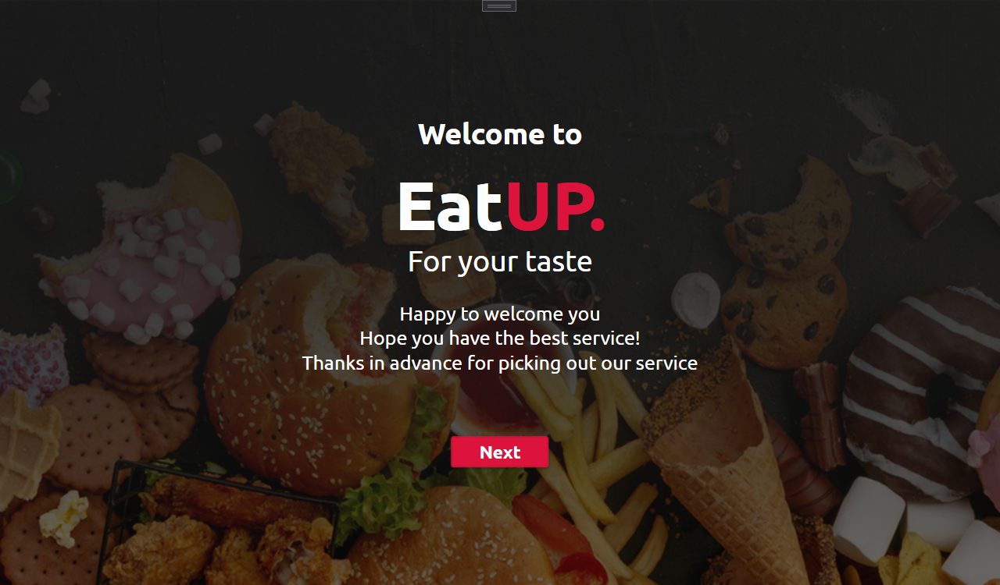
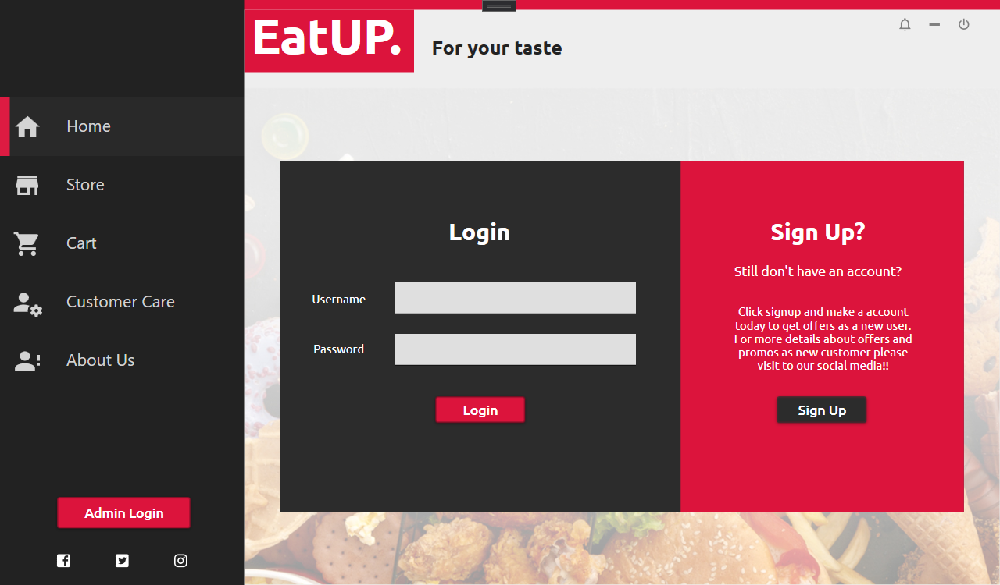
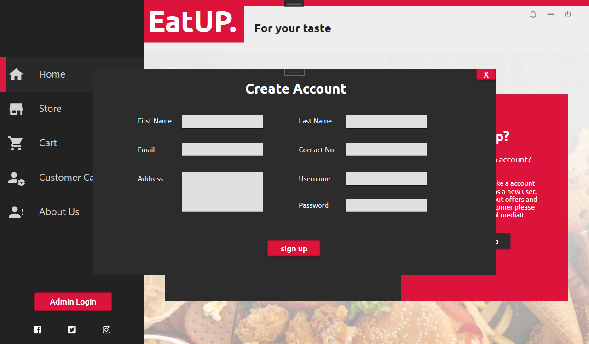
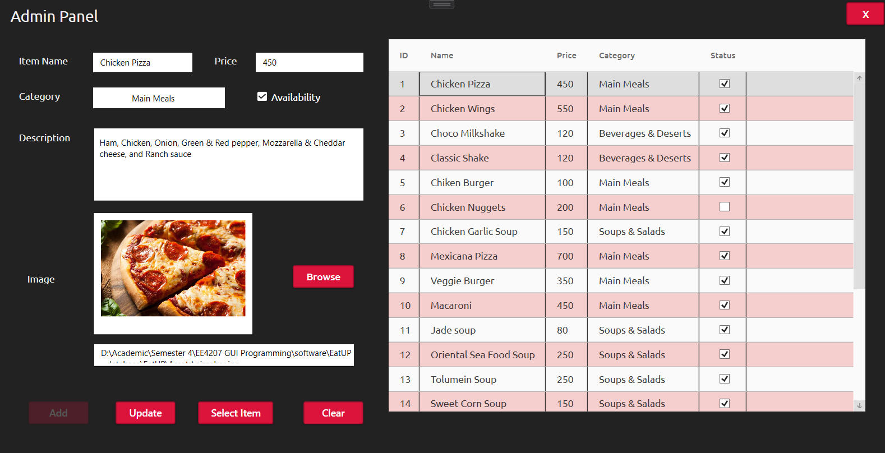
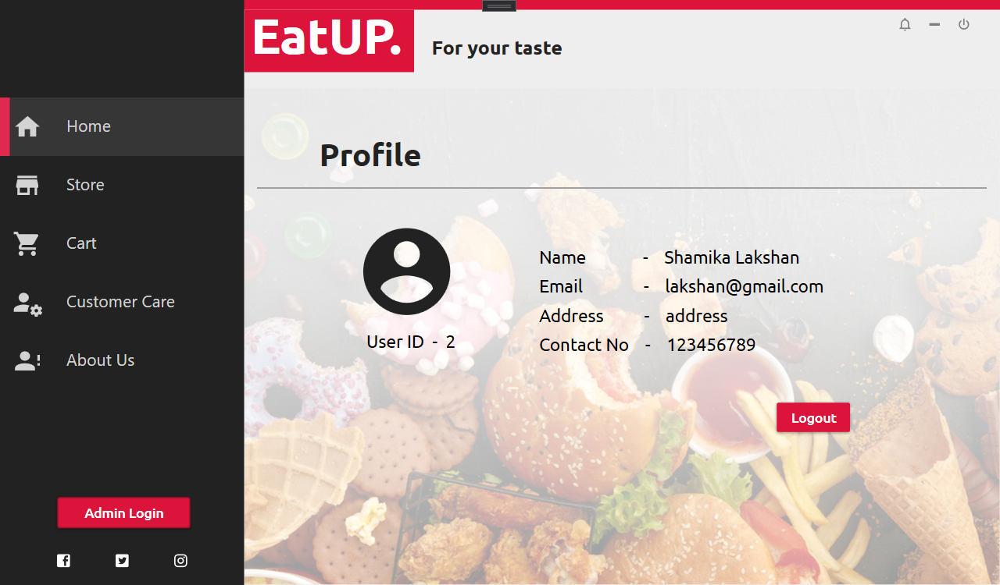
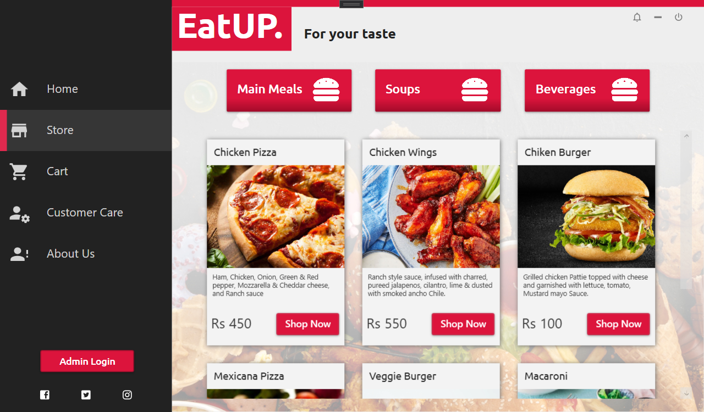
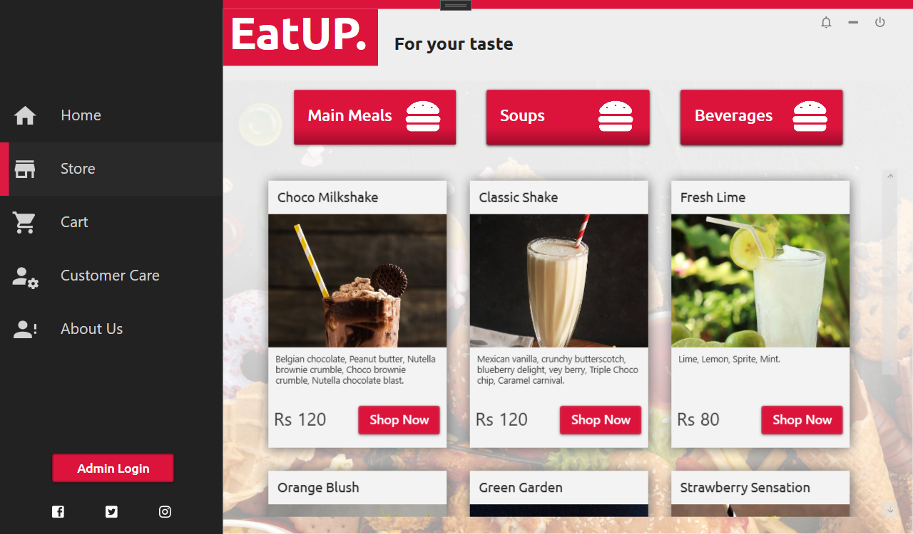
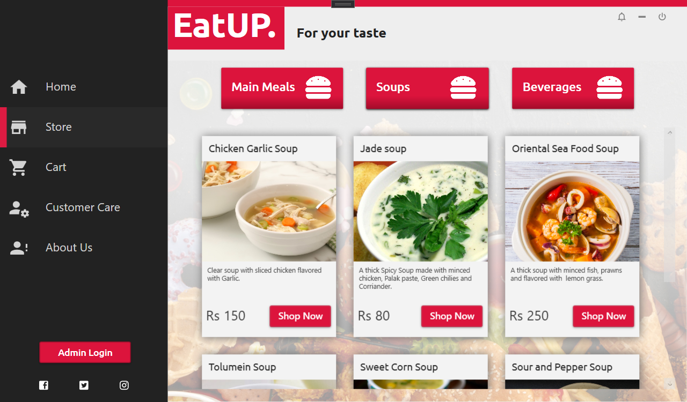
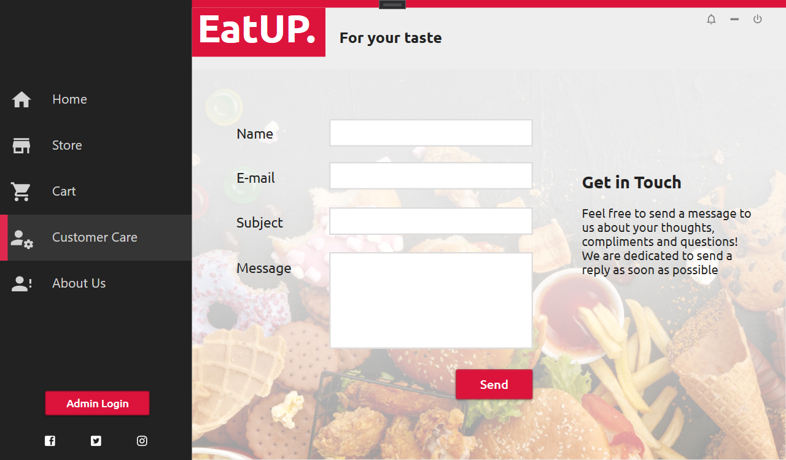
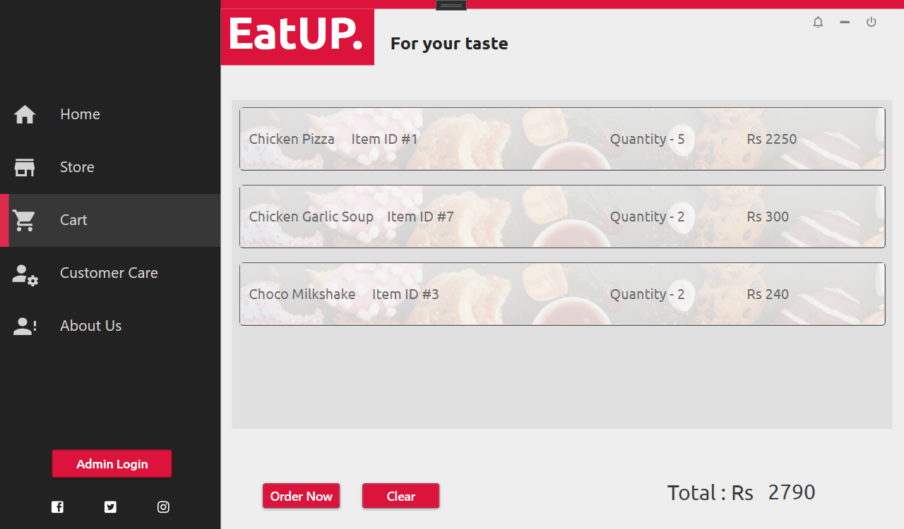

# EatUP Food Delivery Service Management Application

The 'EatUP' Food Delivery Service Management Application is a user-friendly online platform suitable for customers of a restaurant. It is developed using WPF (Windows Presentation Foundation) and C# programming languages. The application allows customers to browse food items, place orders, and make cash-on-delivery payments.

## Screenshots

### Welcome Window

### Login & Signup

### Sign up form

### Admin Panel

Admins have access to add, update, and view the food items list.

### User Profile

### Food Item Display

The application showcases various food item cards displaying the name, photo, price, and description of each item. The food items are categorized into different sections like main meals, beverages, and soups.

#### Main Meals

#### Beverages

#### Soups

### Customer Care

### Shopping Cart

The application allows users to add food items to their cart and proceed with the order placement.

## How to Run the Application

1. Ensure you have the required system specifications to run the 'EatUP' Food Delivery Service Management Application.

2. Clone or download the application repository from [GitHub Repository URL](https://github.com/shan-27/EatUP.git).

3. Open the project in your preferred IDE that supports WPF and C#.

4. Build and run the application to launch the 'EatUP' Food Delivery Service Management Application.

## Features

- User-friendly interface for easy navigation and order placement.
- Secure user authentication and signup system.
- Admin panel to manage food items.
- Various categories for easy food item selection.
- Shopping cart for order management and checkout.
- Customer care support for assistance.

## Acknowledgments

Special thanks to my team member for providing inspiration and support throughout the development of this application.
